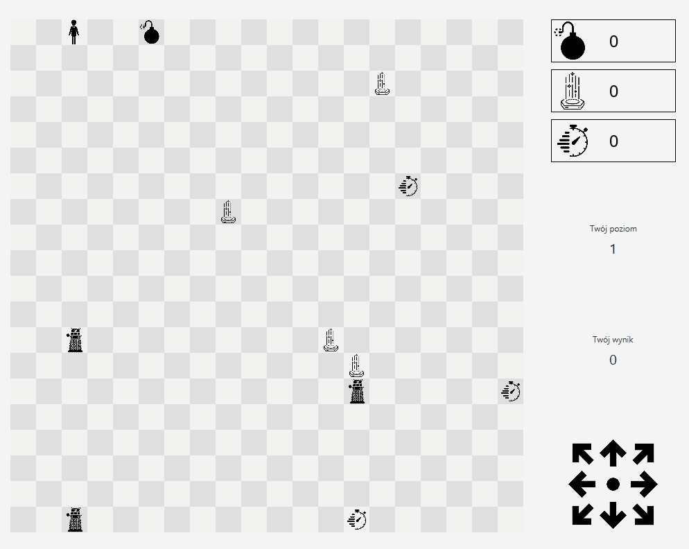

<p align="center">

# Daleks game



</p>

## Overview

Java implementation of popular game from Doctor Who show. Destroy the Daleks by making them run into each other, forming
piles. Running into Daleks or piles will kill you. Daleks will move toward you every time you take any action.

## Build app

To build app as a standalone JAR file run command from terminal in project root directory:

```text
mvn clean package
```

## Running app:

To run app, first build the project using Maven and then:

1. from IntelliJ IDEA:
    - run method `main` located in `pl.edu.agh.ki.to.theoffice.Application` class
2. from terminal:
    - run command in root directory: `java -jar target/Dalek-BETA-1.0.jar`
3. from File Manager:
    - double click file `target/Dalek-BETA-1.0.jar`

## Changelog:

Changelog can be
found [here](https://docs.google.com/document/d/1rmfYHm8JFct24NW3hj8J_BrBJKJ0DGZ0rRZJjOyJvv0/edit?usp=sharing ).

## Contributors ✨

<table>
  <tr>
     <td align="center"><a href="https://github.com/BlqMary"><br /><sub><b>Maria Polak</b></sub></a><br /></td>
    </td>
    <td align="center"><a href="https://github.com/Wokstym"><br /><sub><b>Grzegorz Poręba</b></sub></a><br />
    </td>
    <td align="center"><a href="https://github.com/alexmaz99"><br /><sub><b>Aleksandra Mazur</b></sub></a><br /></td>
    </td>
    <td align="center"><a href="https://github.com/mzlnk"><br /><sub><b>Marcin Zielonka</b></sub></a><br /></td>
</tr>
</table>


    
    
    
